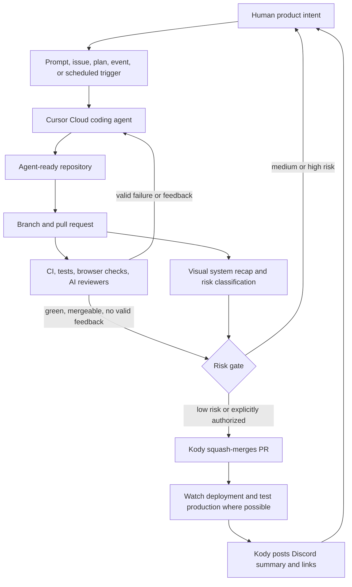

# Kent C. Dodds's AI-agent factory and public AI ecosystem

## TL;DR

Kent's "factory" is not one product or supervisor framework. It is a layered, PR-centric delivery system: Cursor Cloud Agents perform coding work in isolated environments; agent-ready repositories provide instructions, architecture, tests, and reusable skills; CI and AI reviewers produce feedback that agents consume in a loop; a system recap classifies architectural impact and risk; Kody supplies durable tools, credentials, workflows, GitHub actions, and notifications; and human intervention is reserved for product judgment and changes whose risk exceeds the configured autonomy boundary.

The public evidence supports a **network of bounded loops**, not a single autonomous organization of agents. Kent currently uses Cursor heavily, but describes the pattern as host-independent. The autogenerated captions often say "Cody"; the public product and repository are spelled **Kody**.

## Factory architecture

## Layer map

| Layer | Publicly evidenced implementation | Responsibility |
| --- | --- | --- |
| Trigger | Human prompt, PR conversation, Cursor Automation, failed deployment, or schedule | Starts a bounded loop with an explicit or inferred stop condition. |
| Coding worker | Cursor Cloud Agent with isolated VM, browser/desktop access, and persisted authenticated environment | Investigates, edits, runs checks, opens or updates a PR, and responds to machine feedback. |
| Repository context | Small `AGENTS.md` index plus focused project docs, architecture references, tests, and local skills | Gives the agent durable project knowledge without placing every operational detail in its initial context. |
| Work boundary | Git branch and pull request | Provides isolation, history, review status, links, and a stable unit other agents can reference. |
| Verification | Local validation, Playwright/browser checks, GitHub CI, deployment checks | Lets the agent observe whether its work actually functions. |
| Review | Cursor BugBot/Agent Review, CodeRabbit, and human system review | Produces additional evidence; the coding agent must judge whether findings are valid rather than apply them blindly. |
| Risk control | `visual-recap` classification: composes, extends, or adds/removes primitives | Converts architectural impact into an autonomy decision: low risk can flow through; larger contract changes stop. |
| Capability plane | Kody MCP `search`/`execute`, packages, GitHub operations, workflows, secrets, memory, and integrations | Gives an external model durable actions and state without making Kody itself the reasoning model. |
| Completion signal | Discord report with agent, PR, CI, and deployment links | Returns the human to the loop only when finished, blocked, or awaiting a decision. |

## End-to-end delivery loop

1. A human defines product intent or an automation detects an event such as a failed production deploy.
2. A cloud agent receives a scoped task and reads repository guidance. Kent recommends clarifying and planning before implementation rather than treating generation as one-shot.
3. The agent implements on a branch, checks its own work, and opens or updates a pull request. Kent prefers PRs for meaningful work because they create defined, referencable areas of work.
4. The agent generates or updates a system recap from the real diff. The recap lists touched primitives, diagrams the changed flow, records invariants, and classifies overall risk.
5. The agent marks the PR ready, waits for CI, reads AI-reviewer feedback, fixes valid failures, ignores incorrect or insignificant findings, checks mergeability, rebases if necessary, pushes, and repeats.
6. Once CI is green and no valid feedback remains, a risk gate decides whether to continue. Low-risk or explicitly authorized work may be squash-merged by Kody; medium/high-risk work waits for human judgment.
7. After merge, the agent watches deployment and tests production to the extent the environment permits.
8. Kody sends Kent a Discord summary with links. This notification is the stop condition that returns human attention to the process.

The published [`ship-pr` skill](https://github.com/kentcdodds/kody/blob/main/.agents/skills/ship-pr/SKILL.md) encodes this loop. Kent says he performed it manually 92 times before formalizing it, illustrating his preference to automate observed repetition rather than design speculative process up front.

## System review and risk classification

The [`visual-recap` skill](https://github.com/kentcdodds/kody/blob/main/.agents/skills/visual-recap/SKILL.md) moves review above raw line-by-line diffs. It derives claims from the actual branch diff and a repository-owned [primitive taxonomy](https://github.com/kentcdodds/kody/blob/main/docs/contributing/architecture/primitives.yaml), then inserts a structured block into the PR description.

| Classification | Meaning | Default risk implication |
| --- | --- | --- |
| `composes` | Uses existing primitives without changing their contracts | Low; candidate for autonomous merge/deploy. |
| `extends` | Changes a primitive's behavior, shape, or contract | Medium; normally deserves a human look. |
| `adds` | Adds or removes a system primitive | High; architectural decision and explicit approval are expected. |

The recap can include primitives touched, labeled system edges, request/sequence flow, before/after shapes, invariants, and plan-versus-actual drift. It supplements rather than formally replaces code review, but it lets Kent spend attention on architecture, product behavior, and unexpected crossings in very large agent-generated changes.

## Kody's role

[Kody](https://github.com/kentcdodds/kody) is the factory's capability and persistence layer, not its coding model. Its documentation states that Kody makes no inference calls: Cursor, Claude, ChatGPT, Codex, or another MCP host supplies intelligence. Kody supplies the durable environment the intelligence can use.

- A compact MCP surface centered on capability `search` and sandboxed code-mode `execute`, avoiding hundreds of static tool descriptions in model context.
- Per-user memory, values, packages, jobs, workflows, email, webhooks, remote connectors, and durable storage.
- Server-side credentials with no `secret_get`; agents reference secret names and Kody substitutes credentials only at approved network boundaries.
- Reusable packages that turn successful one-off agent code into persistent, editable capabilities.
- [Cloudflare Workflows](https://github.com/kentcdodds/kody/blob/main/docs/use/workflows.md) for retryable, scheduled, long-running, or externally waiting operations.
- GitHub operations used by `ship-pr` and Discord operations used for completion reports.
- Portability across MCP-capable hosts, with ChatGPT described as a likely primary target but not an exclusive one.

A useful mental model is: **Cursor is a current factory worker; GitHub is the work ledger; CI and review bots are inspectors; repository skills are standard operating procedures; Kody is the tool crib, credential broker, durable runtime, and notification bus; Kent is the product owner and risk authority.**

## Triggered and unattended loops

Kent's companion loop-engineering explanation expands the trigger beyond a human prompt. Public examples include production CI failure launching an agent that investigates and opens a repair PR, nightly documentation sweeps removing stale temporal language, and cleanup passes removing unnecessary tests that merely prove deleted behavior remains absent. PR review feedback itself becomes the next input, so the human no longer has to say "check again" after every commit.

He frames this economically as trading **compute for attention**. Cloud VMs, browser checks, CI, reviewer bots, and retries can be expensive; a successful factory therefore optimizes autonomous value per inference cost and human-time cost, not raw generated code or task count.

## Human role and autonomy boundary

Kent does not advocate blind autonomy for safety-critical or irreversible systems. Humans retain responsibility for understanding users and product intent, designing or reshaping primitives, deciding architecture, setting permissions and risk tolerance, and intervening when changes affect foundational contracts. Feature flags, reversible changes, new surfaces not yet exposed to users, and a credible fail-forward path make greater autonomy reasonable.

He also argues that each software factory will be shaped by its product. A universal loop can provide common mechanics, but good primitives, checks, risk signals, and approval boundaries must reflect the repository and its users. Useful metrics include automated throughput and cost, but also failures where the absence of a human caused harm or rework.

## Public ecosystem

| Area | Public artifact | Relationship to the factory |
| --- | --- | --- |
| Core assistant/runtime | [kentcdodds/kody](https://github.com/kentcdodds/kody) and [heykody.dev](https://heykody.dev/) | Capability, memory, secrets, package, workflow, GitHub, and notification substrate. |
| Production codebase | [kentcdodds/kentcdodds.com](https://github.com/kentcdodds/kentcdodds.com) | Demonstrates agent-oriented docs, `ship-pr`, strong validation, Cloudflare services, semantic search, and AI content workflows. |
| Hosted agent experiment | [kentcdodds/flying-jarvis](https://github.com/kentcdodds/flying-jarvis) | Adjacent OpenClaw deployment with persistent state, `main`/`hooks` agents, webhooks, Discord, and automated deployment; not clearly the same coding factory. |
| Agent-facing site | [kentcdodds.com MCP](https://kentcdodds.com/about-mcp) | Exposes site search and selected account/content operations to external agents. |
| Retrieval | [Hybrid semantic and lexical search](https://kentcdodds.com/blog/implementing-hybrid-semantic-lexical-search) | Production use of Workers AI embeddings, Vectorize, lexical retrieval, health/sync status, and a dedicated search worker. |
| Content automation | [Call Kent AI workflow](https://kentcdodds.com/blog/helping-you-ask-me-questions-with-ai) | AI voice/question intake and automated transcript, metadata, audio, and episode-draft processing. |
| Interactive MCP | [cloudflare-remix-vite-mcp](https://github.com/kentcdodds/cloudflare-remix-vite-mcp) | Reference implementation for MCP Apps/widgets with two-way assistant/UI communication. |
| MCP infrastructure | [cloudflare-remote-mcp-server](https://github.com/kentcdodds/cloudflare-remote-mcp-server) | OAuth-protected remote MCP server and client configuration example. |
| Agent steering | [epic-agent](https://github.com/kentcdodds/epic-agent) | Domain-specific workshop retrieval, evaluation, review, and agent steering. |
| Education | [EpicAI.pro](https://www.epicai.pro/) and [epicweb-dev repositories](https://github.com/orgs/epicweb-dev/repositories) | Strategic teaching layer for MCP, AI-connected applications, security, and agent-facing architecture. |

## Transferable design principles

1. Optimize the complete act-observe loop rather than the initial prompt.
2. Give agents executable success conditions: tests, browser access, CI, deploy status, health endpoints, and production probes.
3. Use PRs as transactional work boundaries and machine-readable coordination artifacts.
4. Make repository architecture legible through focused docs, stable terminology, explicit invariants, and a small set of useful primitives.
5. Treat reviewer output as evidence to evaluate, not instructions to obey blindly.
6. Convert stable repeated behavior into small skills; keep exploratory work conversational until the true loop is visible.
7. Scale autonomy according to impact, reversibility, testability, and the quality of available primitives and reviewers.
8. Keep credentials outside model context and constrain where authenticated actions can occur.
9. Review the system and product behavior first when generated diffs exceed human review capacity.
10. Measure value against both inference cost and displaced human attention.

## Reproduction blueprint

Start with one repository. Create a minimal `AGENTS.md` that links focused project documentation; establish one authoritative validation command plus browser-level checks; require agents to work through PRs; add one AI reviewer; teach the coding agent to repeat until CI is green and valid feedback is resolved; introduce a simple low/medium/high risk gate; permit autonomous merge only for low-risk reversible work; watch deployment; and send a completion notification containing evidence links. Record recurring human interventions and turn only proven patterns into skills.

## Evidence and limitations

Primary evidence includes the target video [“Forget ‘read the code,’ I don't even merge PRs myself”](https://www.youtube.com/watch?v=lfSnYGdtbqE), [“I've been loop engineering for months…”](https://www.youtube.com/watch?v=jCZKiHrUNT4), [“Stop Reviewing Diffs. Start Reviewing Systems.”](https://www.youtube.com/watch?v=Xs-U7SY2uNE), [“What the devil is a Factory Engineer?!”](https://www.youtube.com/watch?v=qd6ltKUcp9U), Kody's repository and usage/architecture docs, Kent's public repositories, and Kent's own posts and talks.

The YouTube evidence used English autogenerated captions and may contain transcription errors. No public source defines a single canonical supervisor topology or complete model-routing matrix. Live prompts, credentials, telemetry, private project configuration, and some deployment policies are necessarily absent. Consequently, relationships among adjacent projects are labeled as ecosystem context rather than asserted as components of one unified production system.
